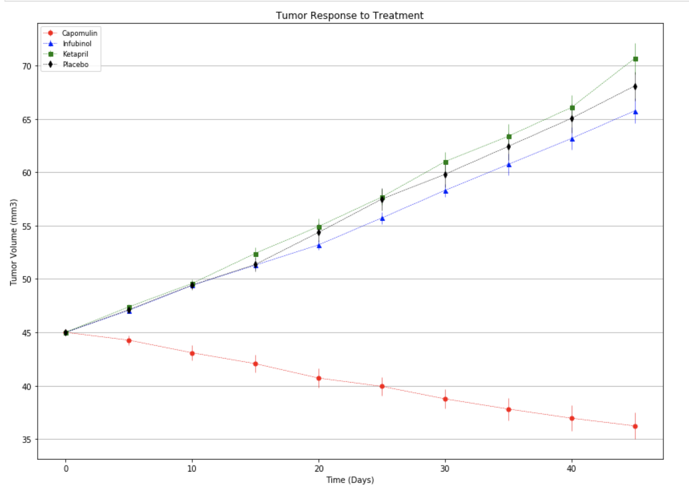
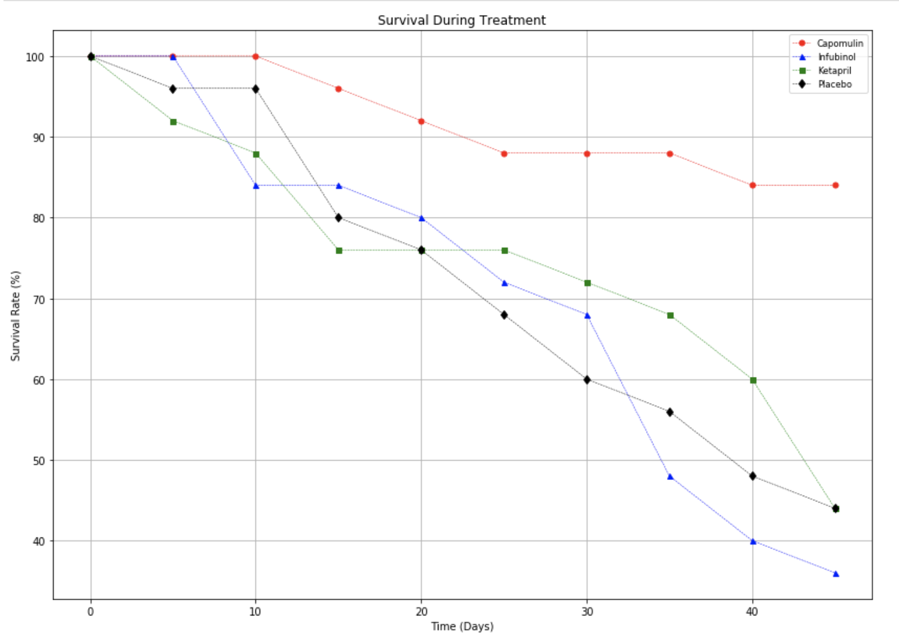
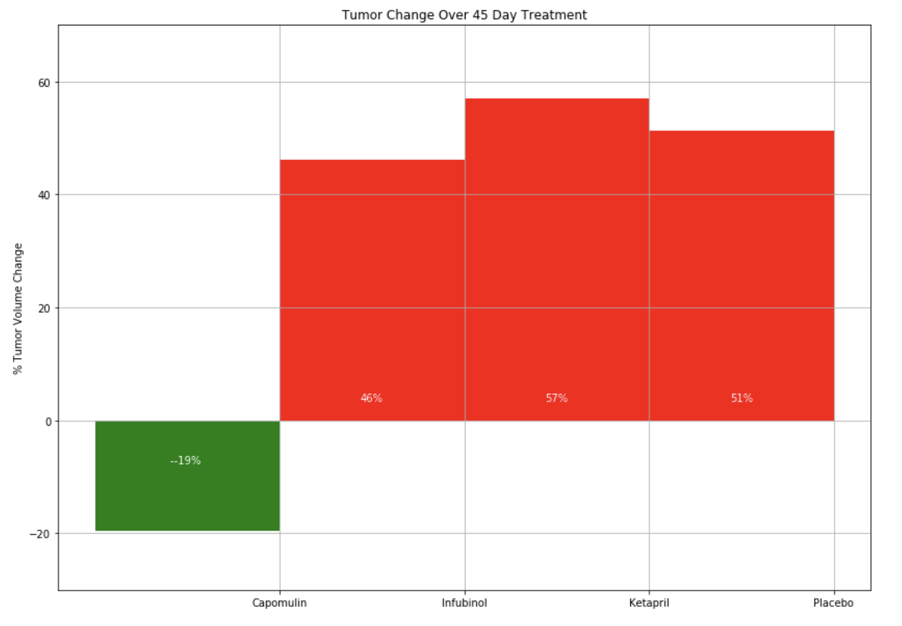

# Matplotlib Homework - The Power of Plots

## NOTE: Though this is a Matplotlib assignment, feel free to use Bokeh, or any Python visualization library if you prefer something else.

## Background

What good is data without a good plot to tell the story?

So, let's take what you've learned about Python Matplotlib and apply it to a real-world situation.

### Before You Begin

1. Create a new repository for this project called `matplotlib-challenge`. **Do not add this homework to an existing repository**.

2. Clone the new repository to your computer.

3. Inside your local git repository, create a directory for the assignment **Pymaceuticals**.

4. Add your Jupyter notebook to this folder. This will be the main script to run for analysis.

5. Push the above changes to GitHub or GitLab.

### What To Turn In
1. The Jupyter Notebook containing your solution.
2. A .docx file or pdf containing three (or as many as you feel necessary) observations about the data. 

### Note:
If you want to make additional plots, or make observations about things that aren't explicitly included in the assignment, that is just fine, and even encouraged. The ultimate goal of this assignment is to practice visualizing data.

## Pymaceuticals Instructions

### The Plots
Create four plots. The first three will use [plt.errorbar](https://matplotlib.org/3.1.1/api/_as_gen/matplotlib.pyplot.errorbar.html) and will visualize the following:

* Tumor volume change over time for each treatment.

* [Metastatic](https://en.wikipedia.org/wiki/Metastasis) (cancer spreading) sites change over time for each treatment.
* 

* Creating a plot that shows how the tumor volume changes over time for each treatment.

* The final plot is a bar graph that compares the total % tumor volume change for each drug across the full 45 days.

### Observation Portion
* Include 3 observations about the results of the study. Use the visualizations you generated from the study data as the basis for your observations.

### As final considerations:

* You must use the Pandas Library and the Jupyter Notebook.
* You may use matplotlib, but feel free to use Bokeh or any other Python-based visualization library if you find you're getting better results, or simply if you prefer it.
* You must include a written description of three observable trends based on the data.
* You must use proper labeling of your plots, including aspects like: Plot Titles, Axes Labels, Legend Labels, X and Y Axis Limits, etc.
* Your plots must include [error bars](https://en.wikipedia.org/wiki/Error_bar). This will allow the company to account for variability between mice. You may want to look into [`pandas.DataFrame.sem`](http://pandas.pydata.org/pandas-docs/stable/generated/pandas.DataFrame.sem.html) for ideas on how to calculate this.
* Remember when making your plots to consider aesthetics!
  * Your legends should not be overlaid on top of any data.
  * Your bar graph should indicate tumor growth and reduction with two different colors.
    It should also include a label with the percentage change for each bar. You may want to consult this [tutorial](http://composition.al/blog/2015/11/29/a-better-way-to-add-labels-to-bar-charts-with-matplotlib/) for relevant code snippets.
* See [Starter Workbook](Pymaceuticals/pymaceuticals_starter.ipynb) for a reference on expected format. (Note: For this example, you are not required to match the tables or data frames included. Your only goal is to build the scatter plots and bar graphs. Consider the tables to be potential clues, but feel free to approach this problem, however, you like.)

## Hints and Considerations

* You have been provided a starter notebook. Use the code comments as a **guideline** of steps you may wish to follow as you complete the assignment. You do not have to follow them step-for-step. Do not get bogged down in trying to interpret and accomplish each step.

* The Pymaceuticals example _will_ require you to research a good bit on your own for hacked solutions to problems you'll experience along the way. Feel encouraged to constantly refer to Stack Overflow and the Pandas Documentation. These are needed tools in every data analyst's arsenal.

* Don't get bogged down in small details. Always focus on the big picture. If you can't figure out how to get a label to show up correctly, come back to it. Focus on getting the core skeleton of your notebook complete. You can always re-visit old problems.

* Remember: There are many ways to skin a cat, and similarly there are many ways to approach a data problem. The key throughout, however, is to break up your task into micro tasks. Try answering questions like: "How does my Data Frame need to be structured for me to have the right X and Y axis?" "How do I build a basic scatter plot?" "How do I add a label to that scatter plot?" "Where would the labels for that scatter plot come from?". Again! Don't let the magnitude of a programming task scare you off. Ultimately, every programming problem boils down to a handful of smaller, bite-sized tasks.

* Get help when you need it! There is never any shame in asking. But as always, ask a _specific_ question. You'll never get a great answer to: "I'm lost." Good luck!

### Copyright

Trilogy Education Services © 2019. All Rights Reserved.
